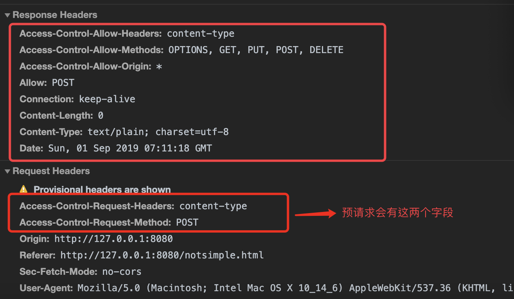
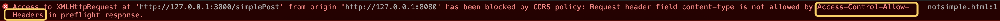
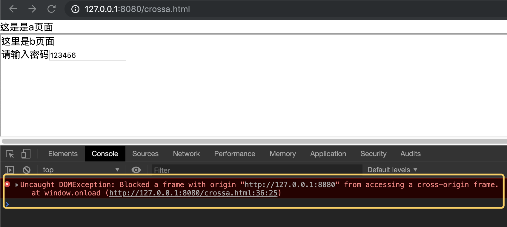

<!--
 * @Description: 跨域
 * @Author: wangyi
 * @Date: 2019-08-31 09:30:30
 * @LastEditTime: 2019-09-02 15:18:55
 * @LastEditors: Please set LastEditors
 -->

# 关于跨域的问题

## **关于跨域这个问题对于前端来说并不陌生，而且也经常会碰到这个问题，那么今天就来总结一下跨域这个问题。**

一、我们需要知道为什么会有跨域的问题或者跨域的目的是为了解决什么问题?那么要从浏览器的同源策略说起，**首先什么是同源策略**？

1、 我们现在来打个比方:你家的钥匙本来只有你一个人有，但现在大家都拥有你家的钥匙，可以任意进出你家，想干嘛就干嘛，那是不是乱了套了; **通过这个比方我们可以知道同源策略的目的: 为了保护用户的信息安全，不被任意的篡改而制定的一种浏览器的安全机制**;

2、 **同源策略必须遵守以下 3 个条件:**

1. **协议相同**;
2. **域名相同**;
3. **端口相同**;

我们这边举个例子: <https://www.demo.com>这个网址，**协议名是 https,域名是 www.demo.com，端口是 80(默认为 80，可以不写)**;

我们来举个例子:

- <http://www.demo.com> **非同源，协议不同**
- <https://vip.demo.com> **非同源， 域名不同**
- <https://www.demo.com:8080> **非同源，端口不同**

好，现在我们知道了什么是同源策略以及它的目的，那么当非同源的情况下，会有什么限制呢？

3、 **非同源下，会限制哪些操作？有以下三种情况会被限制操作**：

1. **Dom 操作**
2. **Cookie、localStorage、indexDB 的操作**
3. **ajax 请求**

### 没有同源策略，可以 DOM 操作会导致什么结果

使用 http-server 启一个简单的本地服务

```html
<!-- 这个是a页面 -- crossa.html -->
<div>这是是a页面</div>
<iframe name="iframe" src="http://127.0.0.1:8081/crossb.html"></iframe>
<script>
  //iframe加载需要时间，直接获取为null
  window.onload = function() {
    let iframe = window.frames["iframe"];
    let node = iframe.document.getElementById("password"); //input元素
    console.log("iframe节点的值为", node.value); //input的输入的值
  };
</script>
```

以上这段代码，如果没有同源策略，可以直接读取到你的表单提交的任何信息，一旦拿到你的这些信息，就可以发起一些攻击，这个我们在后面再讲。

### 没有同源策略，可以进行 ajax 请求会发生什么结果

我们就拿 Cookie 来举例吧

一般请求某个请求时在请求头会带上 Cookie，而 Cookie 值前台可以进行任意修改，比如我现在正在访问<http://www.955588bank.com/login>银行的登录界面并登录成功后，后台会返回一个 Cookie 值，每次请求都必须带，这时候，你又打开了另一个页面<http://www.gouwu.com>，如果这个页面是个非法网站，它可以读取你的 Cookie 值，再带着这个请求头 Cookie 请求发送回你之前已经登录后的银行页面，这时候，它就变成了你，可以操作一切想操作的东西。简而言之，就是对银行网站发起了攻击--CSRF 跨站攻击。这个我们后面一起谈和 XSS 攻击。

### 怎么解决跨域问题

### 我们先来说说最常要用到的 ajax 请求

1. JSONP
2. WebSocket
3. CORS(跨源资源分享)

### JSONP

1. 什么是 JSONP？**以在页面动态添加一个 script 标签的形式，向服务器发送请求，前后端约定好 callback 名字，后台直接返回字符串格式的 callback，因为你是以 script 标签直接运行的，所以直接调起事先定义好的这个 callback 函数**
2. 优点：简单方便，**缺点：只能是 GET 请求**
3. 我们来实现一下：

```html
<!-- 详见jsonp.html -->
<body>
  <button class="btn">点击我</button>
  <p class="result"></p>
  <script>
    function addScriptEle(src) {
      let script = document.createElement("script");
      script.setAttribute("type", "text/javascript");
      script.setAttribute("id", "ajax");
      script.src = src;
      document.body.appendChild(script);
    }
    $(".btn").click(() => {
      console.log("点击了");
      addScriptEle("http://127.0.0.1:3000/data?callback=data");
    });

    function data(res) {
      console.log("得到的数据是", res);
      $(".result").html(res.result); //123
      $("#ajax").remove();
    }
  </script>
</body>
```

```javascript
// 详见index.js
const Koa = require("koa");
const app = new Koa();
const Router = require("koa-router");
const router = new Router();
//方法1
app.use(async ctx => {
  if (ctx.request.query.callback) {
    //前后端一起约定的回调方法
    let callback = ctx.request.query.callback;
    //直接返回字符串
    let jsonpStr = `${callback}(${JSON.stringify({ result: 123 })})`;
    ctx.body = jsonpStr;
  }
});
//方法2
router.get("/data", async ctx => {
  if (ctx.request.query) {
    let callback = ctx.request.query.callback;
    //直接返回字符串
    let jsonpStr = `${callback}(${JSON.stringify({ result: 123 })})`;
    ctx.response.body = jsonpStr;
  }
});
app.use(router.routes());
app.listen(3000, () => {
  console.log("服务在3000端口启动了");
});
```

### WebSocket

WebSocket 的协议分别为 ws://(非加密)和 wss://(加密)，是在 TCP 之上 的协议

### CORS

1. 什么是 CORS？W3C 标准，全名跨源资源分享(Cross-Origin Resource Sharing)的缩写。和 JSONP 只能 GET 请求相比，这个对请求方式没有限制，这才是 ajax 请求正确打开方式。
2. 这个主要需要**服务器端进行设置**，浏览器端发请求按正常的发送就行。
3. 请求方式分为两种：**简单请求和非简单请求**，这两种方式浏览器的请求处理是不一样的。

现在先来谈谈**简单请求**，同时满足以下两个条件：

1. **请求方式,以下 3 种之一**：
   1. **HEAD**
   2. **GET**
   3. **POST**
2. **HTTP 的头信息不得超过以下几种字段**：
   1. **Accept**
   2. **Accept-Language**
   3. **Content-Language**
   4. **Last-Event-ID**
   5. **Content-Type：只限于三个值 application/x-www-form-urlencoded、multipart/form-data、text/plain**
3. **如何操作？**
   1. 浏览器直接发送请求，会在头部自动添加 Origin，对用户而言是无感知的；
   2. Origin 主要包含协议、域名、端口信息，也就是你的请求源(如：<http://127.0.0.1:8080>)，服务器根据这个信息去判断是否给予请求通过；
   3. 那么这里就涉及到服务器端需要去设置以下几个字段： 1. 设置允许请求的域名：Access-Control-Allow-Origin； 2. 可选值，设置是否允许发送 Cookie,是个布尔值：Access-Control-Allow-Credentials，只能设置为 true； 3. 可选值，Access-Control-Expose-Headers； 4. 开启 Access-Control-Allow-Credentials 时，浏览器请求并不会带上 cookie，所以还需开启`xhrFields: { withCredentials: true //必须开启这个值，浏览器发送请求时带cookie }`，同时 Access-Control-Allow-Origin 将不能再设置成\*，`ctx.set("Access-Control-Allow-Origin", "http://127.0.0.1:8080"); ctx.set("Access-Control-Allow-Credentials", "true");`必须设置成与 cookie 相同的域名；

现在再来谈谈**非简单请求**：

1. 什么是**非简单请求**？对服务器有特殊要求的请求。比如 **PUT** 或 **DELETE**，或者 **content-type=application/json**。
2. 非简单请求，会在发起正式请求前，会先对服务器发送一个预请求，方式为 option，看一下请求头的内容是否是服务器设置相匹配的和是否是在白名单里的域名，都通过后，才会发起正式请求。
3. Access-Control-Max-Age 可选字段；用来指定本次预检请求的有效期，单位为秒。下面代码中，有效期为 2 秒，即允许缓存该条回应 2 秒，在此期间，不用发出另一条预检请求；**如果这项没有生效，要查看一下浏览器里是否设置了 Disable cache**；
4. Access-Control-Allow-Credentials，可选值，带 cookie；
5. 举例代码实现如下：

```html
<p>这里是一个非简单请求</p>
<p class="text"></p>
<button class="btn">发送请求</button>
```

```javascript
<script>
  $(".btn").click(() => {
    console.log("点击了");
    $.ajax({
      type: "post",
      url: "http://127.0.0.1:3000/simplePost",
      headers: {
        "Content-Type": "application/json"
      },
      success: res => {
        $(".text").html(JSON.stringify(res));
      },
      error: error => {
        console.log(error);
      }
    });
  });
</script>
```

```javascript
app.use(async (ctx, next) => {
  //允许所有域名通过
  ctx.set("Access-Control-Allow-Origin", "*");
  //允许通过的请求方式
  ctx.set("Access-Control-Allow-Methods", "OPTIONS, GET, PUT, POST, DELETE");
  /**
   * 1. 请求允许通过的头部信息，这里是content-type字段；
   * 2. 如果将content-type改为token，而前端页面未改过，option请求能过，但是会报错 Access-Control-Allow-Headers不允许
   * **/
  ctx.set("Access-Control-Allow-Headers", "content-type");
  await next();
});
router.post("/simplePost", async ctx => {
  ctx.response.body = { data: 123, code: 200 };
});
```

预请求会返回的字段(图 1:都没毛病时，图 2:请求头不一致时与服务器)



### 我们再来谈谈 Dom、localStorage 等

1. Cookie
2. localStorage

### Cookie

1. 什么是 Cookie?Cookie 是服务器写入的一小段代码，只有同源时才能使用。如果只是二级域名不同，一级域名相同，可以通过设置 document.domain 来解决。例如：<http://vip1.example.com>和<http://vip2.example.com>，这里一级域名都为 example，vip1 和 vip2 为二级域名，所以可以通过设置 document.domain 来共享 Cookie。
2. **这种方法只适用于 Cookie 和 iframe 窗口**
3. **服务端设置 Domain，将域名设置为一级域即可**，比如一级域名为.example.com,那么 domain = .example.com；(这里不作演示了);
4. 代码如下：

```html
<!-- 详见cookie->domaina.html -->
<p>这里是a页面</p>
<script>
  //设置1级域名
  document.domain = "127.0.0.1";
  //设置cookie
  document.cookie = "result=hello";
</script>
```

```html
<!-- 详见cookie->domainb.html -->
<p>这里是b页面</p>
<script>
  //直接可以读取a页面的cookie
  console.log(document.cookie);
</script>
```

### iframe 窗口

1. iframe 窗口无法与父窗口进行通信，会报错
2. 一种方法是使用上面提到的 **document.domain 来取得共享的 cookie**；
3. window.postMessage 方法，这是 html5 提供的 API，叫跨文档通信(Cross-document messaging)；
4. 代码如下：

```html
<!-- 父页面 -->
<div>这是是a页面</div>
<iframe name="iframe" src="http://127.0.0.1:8081/crossb.html"></iframe>
<script>
  window.onload = () => {
    let iframe = document.getElementsByTagName("iframe")[0].contentWindow;
    let obj = {
      name: "Jack"
    };
    //往iframe窗口传送值
    iframe.postMessage(
      JSON.stringify({
        key: "storage",
        data: obj
      }),
      "http://127.0.0.1:8081"
    );
  };
</script>
```

```javascript
// 子页面
<script>
    //设置事情监听，父传到子的message
    window.onmessage = function (e) {
      //可以给页面设置源
      if (e.origin !== 'http://127.0.0.1:8080') {
        return;
      }
      let message = JSON.parse(e.data);
      console.log(message); // {data: {name: "Jack"} ,key: "storage"}
      //存储进localStorage
      localStorage.setItem(message.key, JSON.stringify(message.data));
    };
  </script>
```
