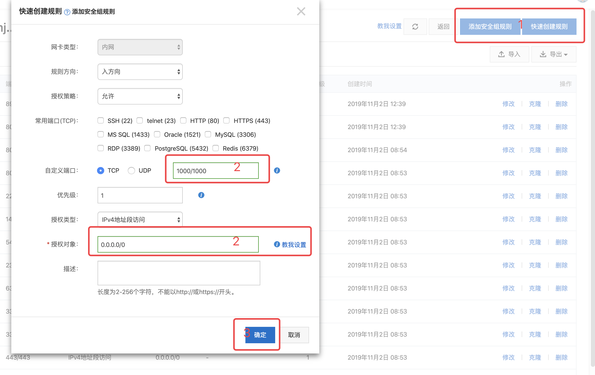
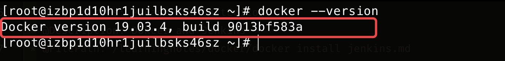
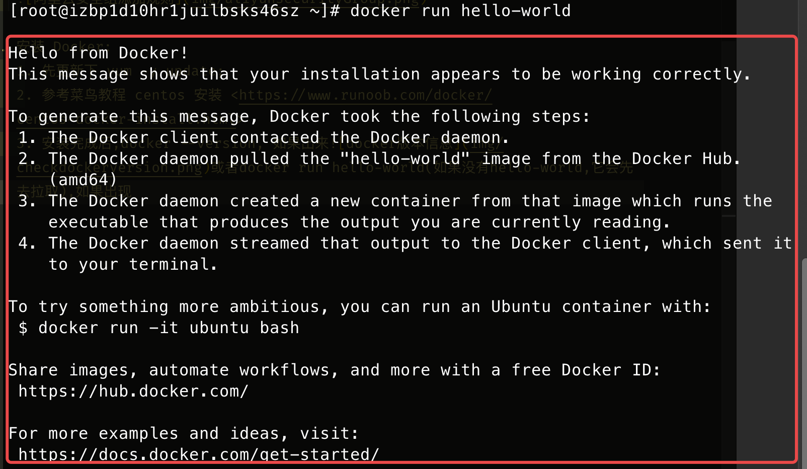
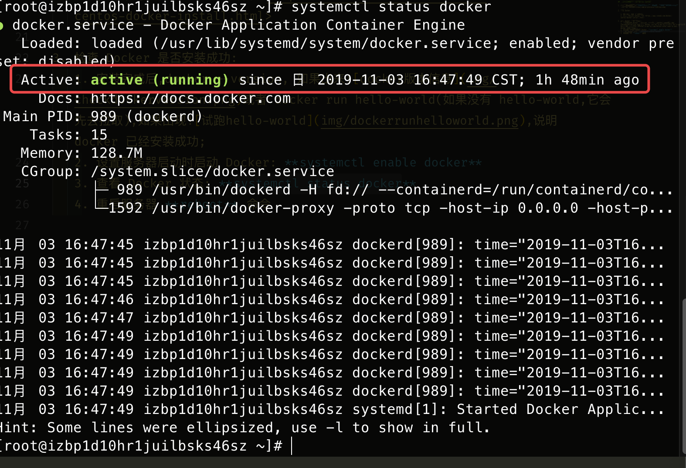
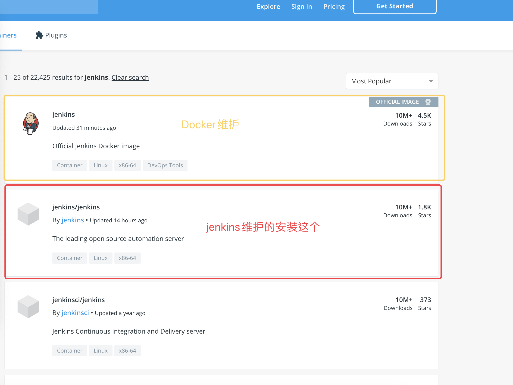

# 在服务器上安装 Docker 及 Jenkins

## 目前使用的系统是 阿里云 Ecs CentOS7

1. 如果是全新的系统，**首先需要去该实例的网络与安全的安全组添加规则**
   

2. 安装 Docker:

   1. 先更新下 yum -y update;
   2. 参考菜鸟教程 centos 安装 <https://www.runoob.com/docker/centos-docker-install.html>

3. 检查 Docker 是否安装成功:
   1. 安装完成后,docker --version, 如果出来或者 docker run hello-world(如果没有 hello-world,它会先去拉取),如果出现,说明 docker 已经安装成功;
   2. 设置服务器启动时启动 Docker: **systemctl enable docker**
   3. 查看 Docker 状态: **systemctl status docker** 
   4. 重启服务器 **reboot** 命令
4. 安装 Jenkins 镜像
   1. hub.docker.com Docker 镜像官网搜索
   2. 下载镜像 **docker pull jenkins/jenkins**
   3. 查看镜像 docker images / 查看某个镜像 docker images | grep jenkins
5. 创建 Jenkins 挂载目录
   1. mkdir /home/jenkins (在/home 下创建 jenkins 文件夹)
   2. chown -R 1000:1000 /home/jenkins (归属用户 ID 必须是 1000),不然 docker logs 容器名,会提示没有权限
6. 启动 **docker run -d --name jenkinsrun -p 8081:8080 -v /home/jenkins/:/var/jenkins_home/ jenkins/jenkins**

   1. -d 后台运行
   2. --name jenkinsrun 容器名字
   3. -p 8081:8080 这个容器的 8080 端口映射到当前这台服务器的 8081 端口上
   4. -v /home/jenkins/:/var/jenkins_home/ 目录挂载，挂载到/home/jenkins 上
   5. jenkins/jenkins 用的镜像
   6. 在浏览器中打开服务器 ip 地址:8081

   **注意:这里的 8080 端口是 jenkins 默认的启动口，如果启动时输别的端口号,浏览器将无法打开这个页面**

7. 开机启动 Dokcer **systemctl enable docker**
8. 开机启动某个镜像 **docker update --restart=always 容器 ID**
9. 查看运行的容器 **docker ps**
10. 查看所有的容器 **docker ps -a**
11. 停止某个容器 **docker stop 容器名称或容器 ID**
12. 重启某个容器 **docker restart 容器名称或容器 ID**
13. 删除容器 **docker rm 容器 ID**
14. 删除镜像 **docker rmi 镜像名**
15. 查看日志 **docker logs 容器名称/容器ID**

docker run -d --name mongo -p 27017:27017 -v /application/mongo/dbconfig:/data/configdb -v /application/mongo/db:/data/db mongo  --auth

db.createUser({ user: 'admin', pwd: '123456', roles: [ { role: "userAdminAnyDatabase", db: "admin" } ] });

