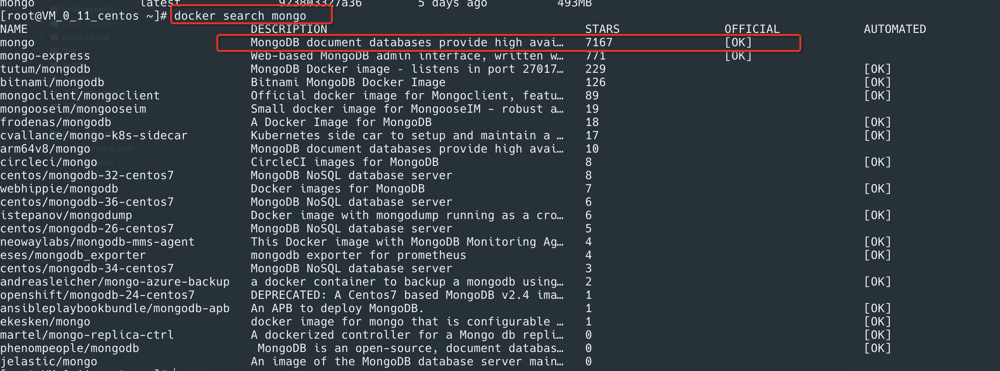
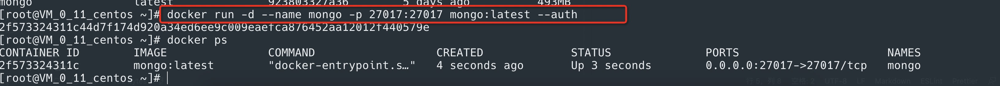

# 在 CentOs 用 Docker 安装 MongoDB

1. docker search mongo，选择第一个官方的镜像
2. 拉取镜像 docker pull mongo
3. 开启身份验证启动容器
4. 以管理员身份进入 mongo 内部 **docker exec -it mongo mongo admin**
5. 创建管理员帐号 **db.createUser({ user: 'admin', pwd: '123456', roles: [ { role: "userAdminAnyDatabase", db: "admin" } ] });**
6. 身份授权 **db.auth('admin','123456')**,如果显示 1，说明授权成功
7. 查看现在在哪个 database **db**
8. 查看所有 database **show dbs 或者 show databases**
9. 创建数据库 **use blog**，如果这个库存在则直接切换，如果不存在，则会自动创建
10. 在 blog 数据库下创建新用户 **db.createUser({ user: 'test', pwd: '123456', roles: [ { role: "readWrite", db: "blog" } ] });**

## 用 navicat 无法连接 mongodb 时，报连接超时解决方案

1. 先 ping 一下 ip 地址，是否能 ping 通
2. 查看一下服务器是否打开了对应端口
3. 查看一下防火墙是否开启对应端口 -- firewall-cmd --zone=public --add-port=27017/tcp --permanent(--zone 表示作用域、--add-port 添加端口，格式为：端口/通讯协议 、permanent 永久有效)
4. 重启防火墙 -- firewall-cmd --reload / systemctl restart firewalld.service
5. 开启防火墙 -- systemctl start firewalld.service
6. 关闭防火墙 -- systemctl stop firewalld.service
7. 查看防火墙状态 -- firewall-cmd --state
