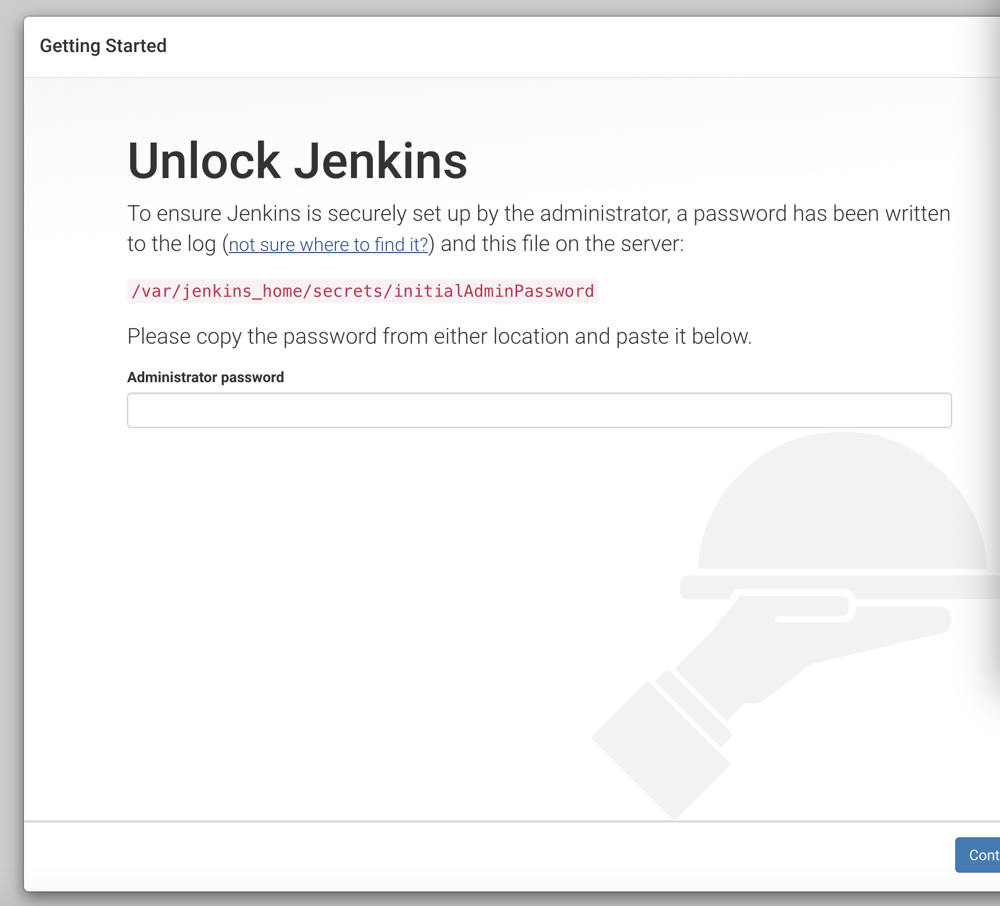
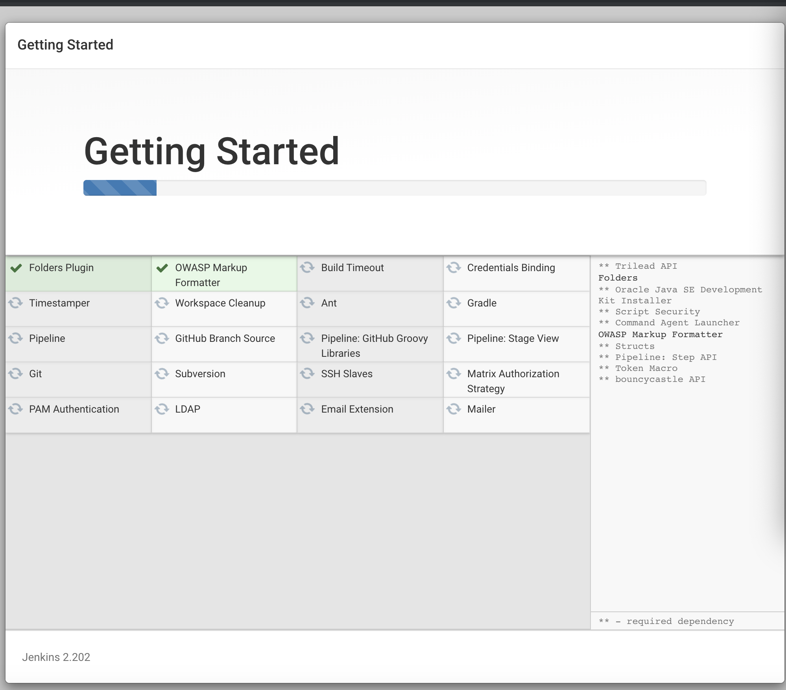
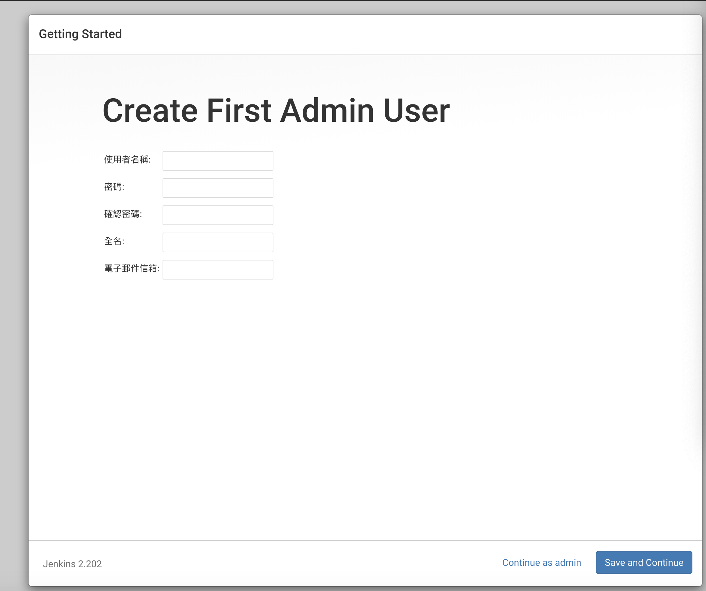
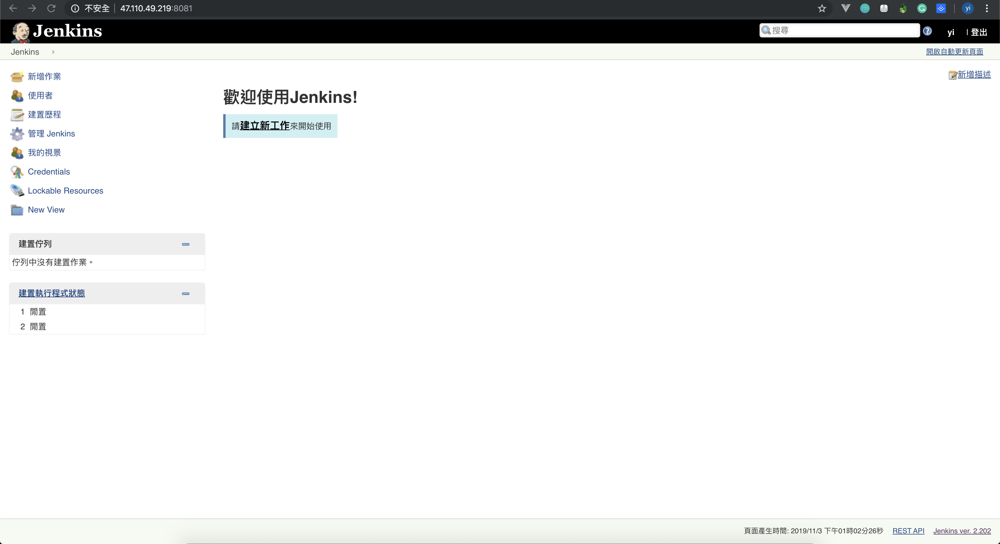
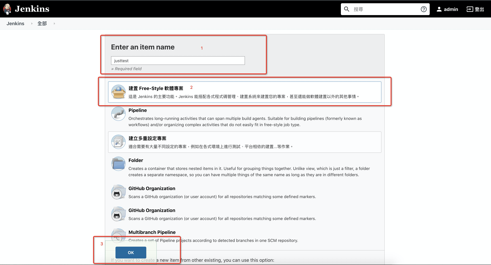
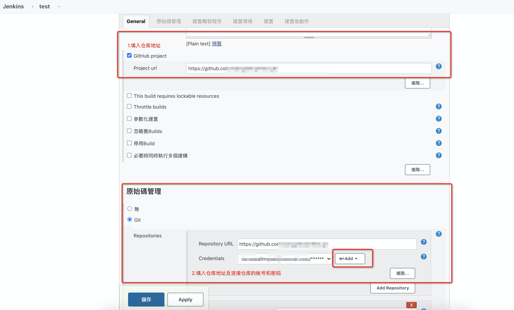
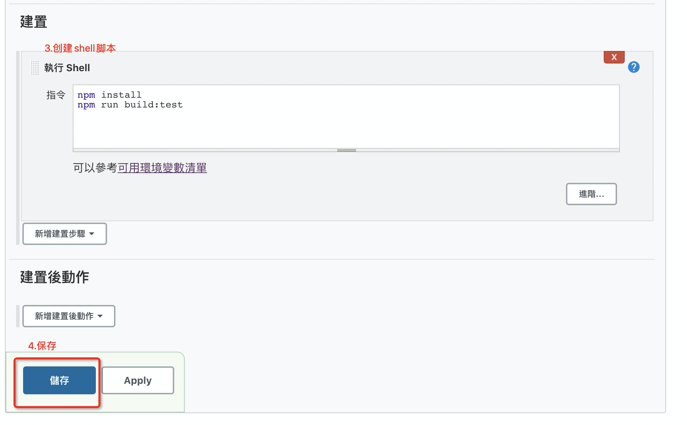
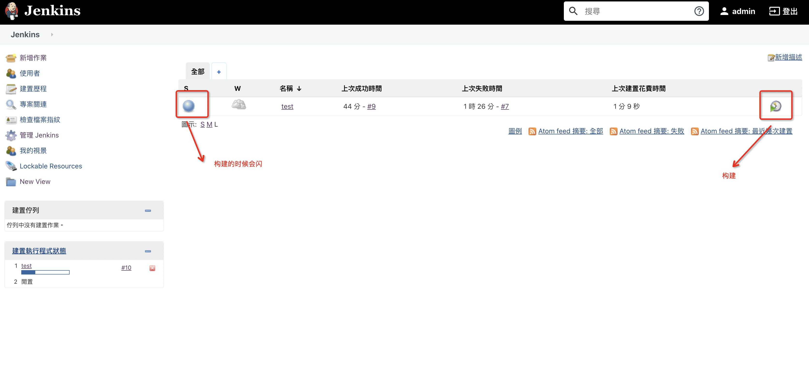
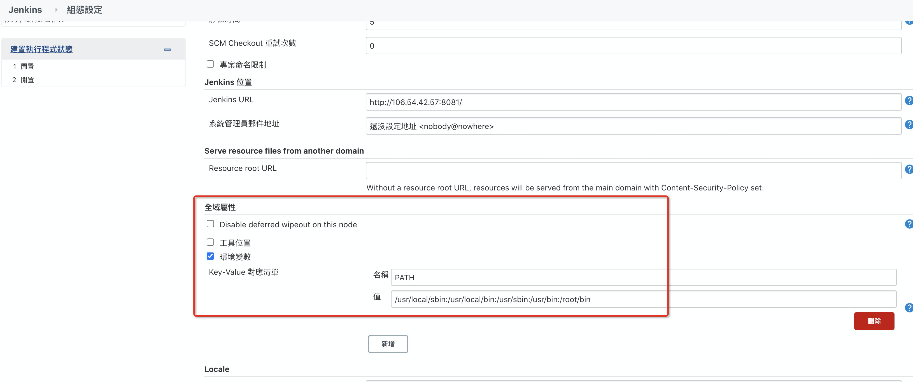
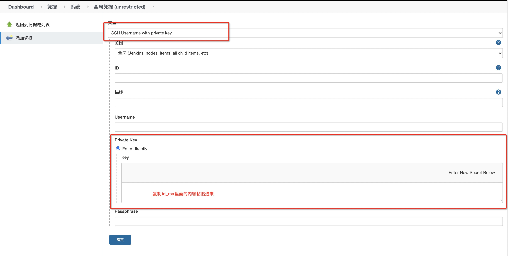

<!--
 * @Author: wy
 * @Date: 2019-11-03 19:56:52
 * @LastEditTime: 2021-03-15 14:14:27
 * @LastEditors: Please set LastEditors
 * @Description:
 * @FilePath: /learningnotes/jenkinsconfig/jenkinsConfig.md
-->

# Jenkins 配置

## 注意:安装 git

1. **登录 Jenkins** 
2. 首先需要解锁管理员,如果没有挂载过目录，直接去页面上的文件夹获取管理员密码 **cat /var/jenkins_home/secrets/initialAdminPassword**;
3. 如果挂载过目录则要去 **cat /home/jenkins/secrets/initialAdminPassword**
4. 输入后,点击 continue,等待....
5. 插件安装
6. 插件安装进行中....
7. 创建管理员,保存并继续..
8. 实例配置完成,url:服务器 ip 地址+8081，修改端口 vim /etc/sysconfig/jenkins --> JENKINS_PORT=8081，保存，重启 Jenkins
9. 完成后,进入到主页
10. 新增作业
11. 选择仓库
12. 最后保存
13. 构建工程

## 构建过程中如果提示 npm not found 时，需要在 jenkins 全局设置中添加系统环境变量,先在 liunx 中 echo $PATH 找到地址，复制进去便可

管理 Jenkins --> 系统设定 --> 全域属性中添加

## Jenkins 系统简体中文设置

1. 首页 --> 系统管理 --> 插件管理 ---> 安装 Locale plugin 和 Localization: Chinese (Simplified)，安装完后重启
2. 首页 --> 系统管理 --> 系统配置 ---> Locale 选项 --> 填入 Default Language 为 zh_CN，然后勾选 Ignore browser preference and force this language to all users，保存即可
3. 如果存在部分英文无法翻译的情况，需要先回到第二步将 Default Language 设置为 zh_US，重启在 url 后加上/restart 即可，待重启完后回到第二步再改回至 zh_CN 保存即可

## Jenkins 重启、关闭方法

1. 重启在 url 后加上/restart，如<http://jenkins.master.com/restart>
2. 关闭在 url 后加上/exit，如<http://jenkins.master.com/exit>

## Centos 重启、关闭、启动 Jenkins

service jenkins start
service jenkins restart
service jenkins stop

## 添加 SSH KEY(为解决 https 拉取 github 代码是一直报连不上远程仓库的问题)

1. 首先检查服务器上是否已经有 SSH KEY

```javascript
cd ~/.ssh
```

2. 如果不存在，创建一个 SSH KEY

```javascript
ssh-keygen -t rsa -C "your_email@example.com"
```

代码参数含义：

- -t 指定密钥类型，默认是 rsa ，可以省略。
- -C 设置注释文字，比如邮箱。
- -f 指定密钥文件存储文件名。
- 以上代码省略了 -f 参数，因此，运行上面那条命令后会让你输入一个文件名，用于保存刚才生成的 SSH key 代码。

3. 然后会得到 id_rsa 和 id_rsa.pub 两个秘钥文件
4. 然后打开 id_rsa.pub 文件，复制去 github，setting --> SSH and GPG keys --> new SSH Key
5. Jenkins 系统管理 --> Manage Credentials(凭证) --> 域(全局) --> 添加凭据
   
