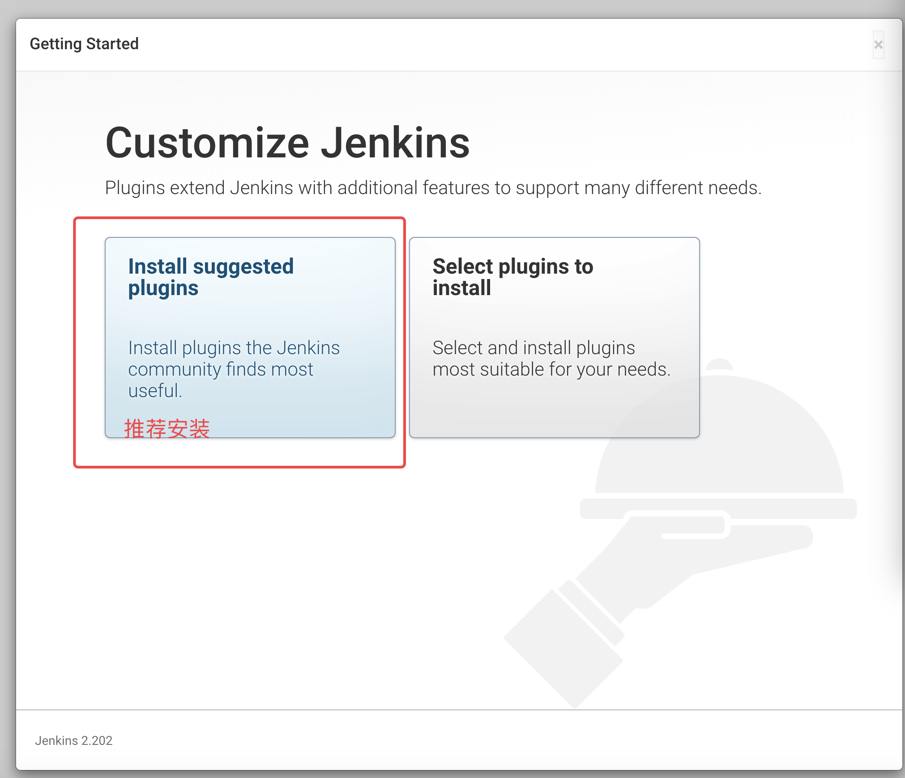

# Jenkins 配置

1. **登录 Jenkins** 
2. 首先需要解锁管理员,如果没有挂载过目录，直接去页面上的文件夹获取管理员密码 **cat /var/jenkins_home/secrets/initialAdminPassword**;
3. 如果挂载过目录则要去 **cat /home/jenkins/secrets/initialAdminPassword**
4. 输入后,点击 continue,等待....
5. 插件安装
6. 插件安装进行中....
7. 创建管理员,保存并继续..
8. 实例配置完成,url:服务器 ip 地址+8081
9. 完成后,进入到主页
