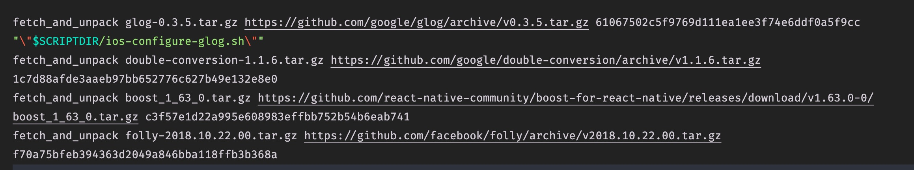
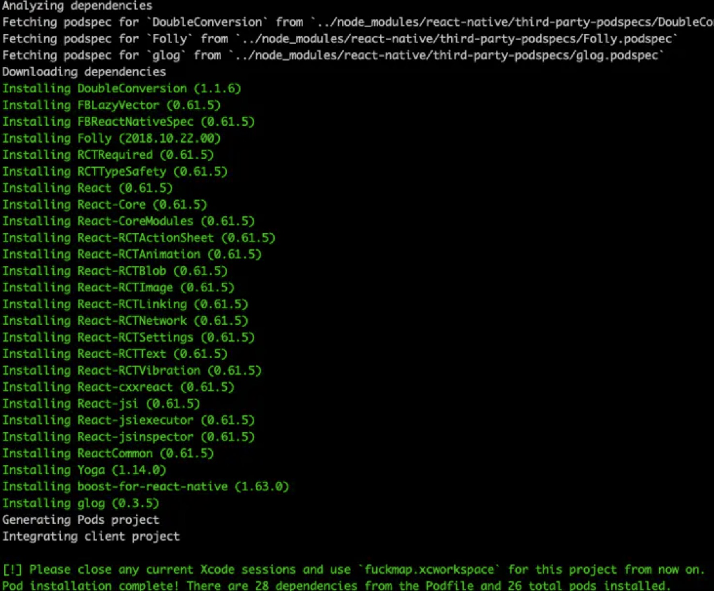
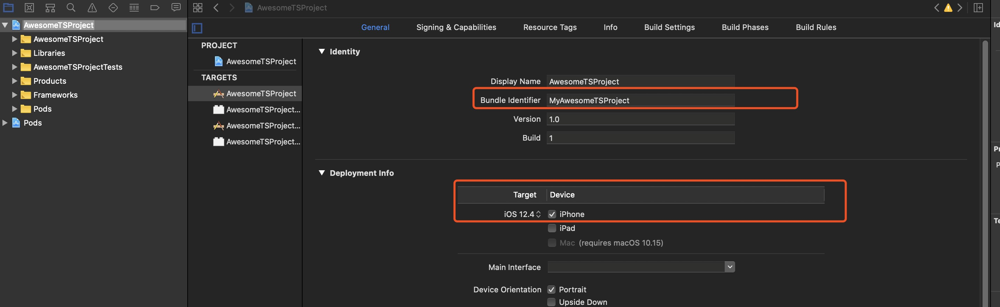
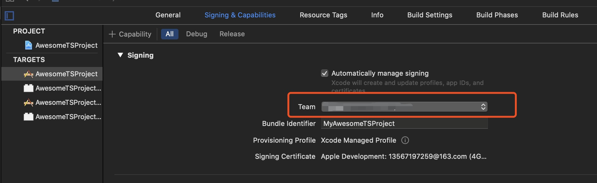
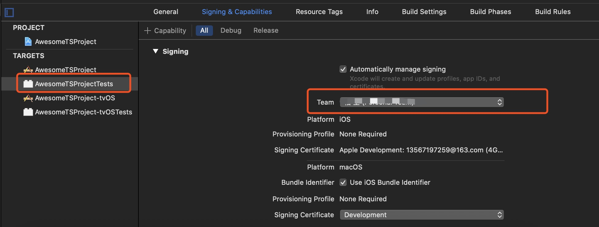
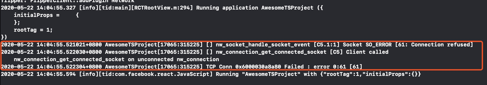

<!--
 * @Author: your name
 * @Date: 2020-05-22 08:48:26
 * @LastEditTime: 2020-05-24 08:35:21
 * @LastEditors: Please set LastEditors
 * @Description: In User Settings Edit
 * @FilePath: /learningnotes/react-native踩过的坑.md
-->

# React Native 工程踩过的坑

## 安装

1. 根据官网安装顺序进行安装，选择 React Native CLI Quickstart 完整安装'https://reactnative.dev/docs/environment-setup'
2. 根据自己的系统选环境
3. 跟着官网安装环境所需的软件 brew install node brew install watchman,watchman 是监听文件
4. 苹果商店安装 Xcode(8G)
5. 安装 cocoapods(IOS 开发需要用到)， sudo gem install cocoapods
6. 创建一个应用 npx react-native init AwesomeProject
7. 进入文件夹 cd AwesomeProject，启动 npx react-native run-ios(这时会报错，在 Xcode 上，**'React/RCTBridgeDelegate.h' file not found**，那是因为没有供 ios 平台启动的文件)

## 安装坑

1. 在第 6 步的时候，下载过程中，到**Installing CocoaPods dependencies**时，因为国内的关系，这一步会安装不成功，然后会提醒你手动去项目的 ios 文件夹进行安装 **cd ios/** **pod install**，会收到下方图的提示
2. 
3. 解决方案：直接去 CocoaPods 官网下载最新的 zip 包,'https://github.com/CocoaPods/Specs',压缩包300M+，大晚上死活下载不下来！！！早起才下载下来，更别说在项目的ios文件夹中的Podfile中顶部添加source 'https://github.com/CocoaPods/Specs.git'，死活不动好吗！！！
4. cd ~/.cocoapods/repos/trunk/Specs 按着错误提示，把所有的包都复制进去
5. 重新 **pod install**，到 Downloading dependencies 时，又会卡住。这该死的墙！！！
6. 在项目文件夹中打开 node_modules/react-native/scripts/ios-install-third-party.sh 这个文件，拉到最底下，能看到项目所需要的**4** 个包，图片如下
7. 
8. 分别点击各自的链接将包下载下来，不需要解压，放到 **cd ~/Library/Caches/com.facebook.ReactNativeBuild**下就行，如果你的 react-native 版本>=0.58,我的是 0.62。 一开始是没有 com.facebook.ReactNativeBuild 这个文件夹的，mkdir 创建一个文件夹
9. 重新 **pod deintegrate**把 Pods 包清除掉，再**pod install**，就能成功了

## 真机运行坑

1. 首先关闭模拟器
2. USB 连接电脑，如果第一次连接，需要注册开发者帐号，如果有苹果 ID，直接去登入就行'https://developer.apple.com/'
3. 修改 Xcode 配置，选中项目-->General-->修改 Bundle Identifier 名字，如果提示，如下图
4. 
5. 
6. 
7. 这样就能 run 起来了
8. 如果在 Xcode 控制台出现，可以在 Product--> Edit Scheme-->Run-->Environment Variables 下添加 OS_ACTIVITY_MODE:disable 即可，就不会出现这些提示了

## 导入 react-native-vector-icons 坑
