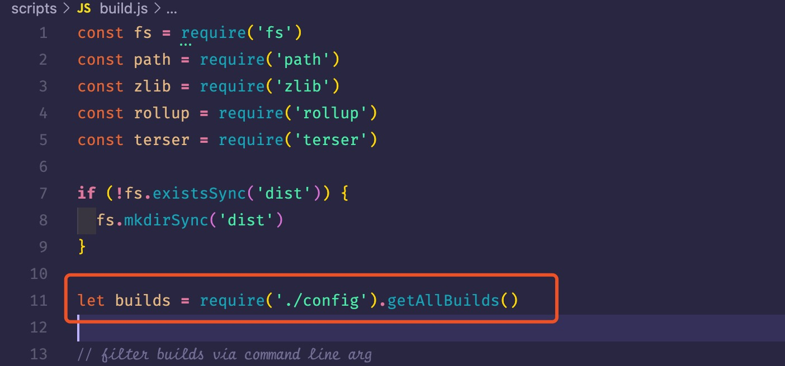

<!--
 * @Author: wy
 * @LastEditors: Please set LastEditors
 * @Description: vue源码
-->

### vue 源码

- 查看 package.json 文件知道 npm run build 对应文件在 scripts 文件夹下的 build.js 中
- build.js 主要是打包出不同的最终文件
- 相关配置文件 config.js

```javascript
//引入alias文件
const aliases = require("./alias");
//alias文件内容
const resolve = (p) => path.resolve(__dirname, "../", p);

module.exports = {
  vue: resolve("src/platforms/web/entry-runtime-with-compiler"),
  compiler: resolve("src/compiler"),
  core: resolve("src/core"),
  shared: resolve("src/shared"),
  web: resolve("src/platforms/web"),
  weex: resolve("src/platforms/weex"),
  server: resolve("src/server"),
  sfc: resolve("src/sfc"),
};
//resolve进行重写
const resolve = (p) => {
  //以 web/entry-runtime.js 为例，base = web
  const base = p.split("/")[0];
  //判断alias文件中存在
  if (aliases[base]) {
    /**
     * aliases[base] ===> '../src/platforms/web'
     * p.slice(base.length + 1) ===> 'entry-runtime.js'
     * 最终返回 ../src/platforms/web/entry-runtime.js
     */
    return path.resolve(aliases[base], p.slice(base.length + 1));
  } else {
    return path.resolve(__dirname, "../", p);
  }
};

const builds = {
  // Runtime only (CommonJS). Used by bundlers e.g. Webpack & Browserify
  "web-runtime-cjs-dev": {
    //对应的入口文件 ../src/platforms/web/entry-runtime.js
    entry: resolve("web/entry-runtime.js"),
    //对应的出口文件 ../dist/vue.runtime.common.dev.js
    dest: resolve("dist/vue.runtime.common.dev.js"),
    format: "cjs",
    env: "development",
    banner,
  },
};

if (process.env.TARGET) {
  module.exports = genConfig(process.env.TARGET);
} else {
  exports.getBuild = genConfig;
  // 传入genConfig函数的 name = "web-runtime-cjs-dev"
  exports.getAllBuilds = () => Object.keys(builds).map(genConfig);
}

function genConfig(name) {
  /*
  如 name = "web-runtime-cjs-dev"
  opts = {
    entry: "../src/platforms/web/entry-runtime.js",
    dest: "../dist/vue.runtime.common.dev.js",
    format: "cjs",
    env: "development",
    banner,
    }
  */
  const opts = builds[name];
  const config = {
    input: opts.entry,
    external: opts.external,
    plugins: [flow(), alias(Object.assign({}, aliases, opts.alias))].concat(opts.plugins || []),
    output: {
      file: opts.dest,
      format: opts.format,
      banner: opts.banner,
      name: opts.moduleName || "Vue",
    },
    onwarn: (msg, warn) => {
      if (!/Circular/.test(msg)) {
        warn(msg);
      }
    },
  };

  // built-in vars
  const vars = {
    __WEEX__: !!opts.weex,
    __WEEX_VERSION__: weexVersion,
    __VERSION__: version,
  };
  // feature flags
  Object.keys(featureFlags).forEach((key) => {
    vars[`process.env.${key}`] = featureFlags[key];
  });
  // build-specific env
  if (opts.env) {
    vars["process.env.NODE_ENV"] = JSON.stringify(opts.env);
  }
  config.plugins.push(replace(vars));

  if (opts.transpile !== false) {
    config.plugins.push(buble());
  }

  Object.defineProperty(config, "_name", {
    enumerable: false,
    value: name,
  });

  return config;
}
```
