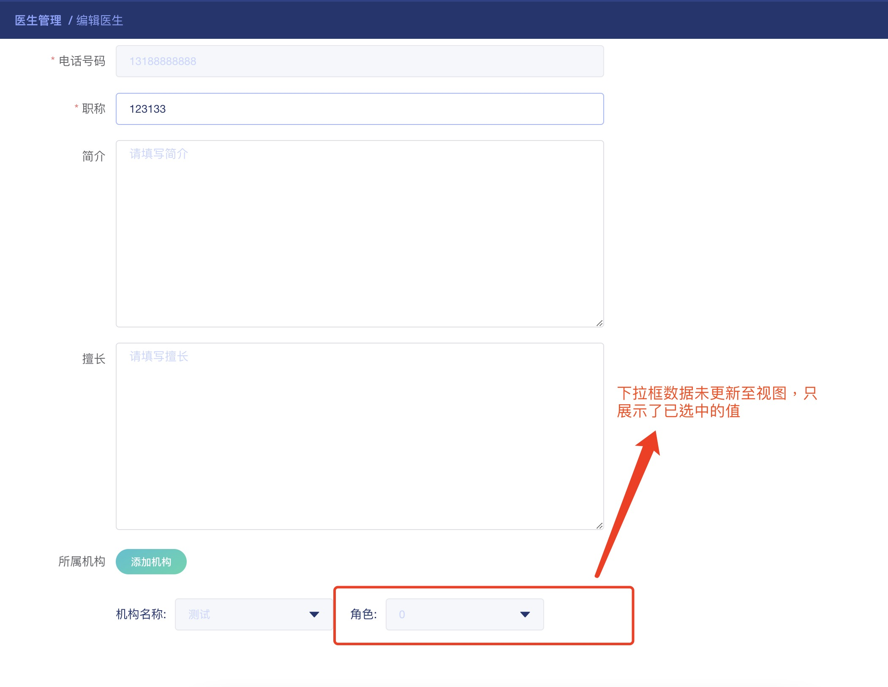

<!-- # 关于修改深层数组，视图不更新问题 -- 与异步请求相关 -->

1. 问题回顾:下拉框复染时，视图未更新

   ```javascript
    const form = {
      // 结构: [{orgId: 'xxxx', roleId: 'xxxxxx', roleList: []}]
      doctorOrgRequest:[]
    }
    //详情接口
     async getDetailRequest() {
      const res = await this.$http.get(`/touc_physical/ops/doctor/detail/${this.$route.query.id}`)
      // 现在被赋值后this.form.doctorOrgRequest的结构如下
      // this.form.doctorOrgRequest = [{ orgId: '1496321886184382465', roleId: '0' }]
      this.form.doctorOrgRequest = res.doctorRoles // ----> 第一次 doctorOrgRequest 中赋值(为之前已经选择过的数据)

      if (this.form.doctorOrgRequest.length) {
        for (let i = 0; i < this.form.doctorOrgRequest.length; i++) {
          this.form.doctorOrgRequest[i].roleList = []
          this.form.doctorOrgRequest[i].isDisabled = true
          // 获取对应下拉框角色数据，第二次修改 doctorOrgRequest 数据，而且还是异步请求
          await this.getRoleRequest(this.form.doctorOrgRequest[i].orgId, i)
        }
      }
      // 最终数据结构 ---->  [{orgId: 'xxxx', roleId: 'xxxxxx', roleList: []}] , 但视图未更新
      this.$forceUpdate() // ----> 强制刷新视图更新，等于重新调用this值
    },
    // 获取角色数据
    async getRoleRequest(orgId, idx) {
      const { data } = await this.$http.get(`/touc_physical/ops/doctor/role/list`, {
        params: {
          pageSize: 100000,
          pageNo: 1,
          orgId: orgId,
        },
        isLoading: false,
      })
      if (data && data.length) {
        this.form.doctorOrgRequest[idx].roleList = data.map(item => {
          return {
            label: item.name,
            value: item.id,
          }
        })
      }
    },
   ```

2. 考虑视图不更新的点:

   - 第一次已在对象中进行了一次赋值(见代码备注,第 15 行)
   - 第二次再次在当前对象中进行 ajax 请求，修改了赋值内容(见代码备注,第 39 行)
   - 因为异步请求，当数据已经拿到的时候，vue 并未监测到此时变量已经再次进行了变更，导致视图并未再次更新

3. 解决方法
   - 第一种方法：在详情接口最后强制刷新视图更新(见代码,第 26 行)
   - 第二种方法：重新组装 `doctorOrgRequest`数据结构(见下方代码，第 65 行~74 行)

```javascript
   async getDetailRequest() {
      const res = await this.$http.get(`/touc_physical/ops/doctor/detail/${this.$route.query.id}`)
      const orgIds = res.doctorRoles.map(item => item.orgId)
      this.organizationList = await this.getOrganizationRequest()
      this.resolveOrgList(orgIds)
      if (res.doctorRoles.length) {
        for (let i = 0; i < res.doctorRoles.length; i++) {
          // 解决方案： 重新装载数据结构
          this.form.doctorOrgRequest.push({
            roleList: await this.getRoleRequest(res.doctorRoles[i].orgId, i),
            isDisabled: true,
            ...res.doctorRoles[i],
          })
        }
      }
    },
    async getRoleRequest(orgId, idx) {
      const { data } = await this.$http.get(`/touc_physical/ops/doctor/role/list`, {
        params: {
          pageSize: 100000,
          pageNo: 1,
          orgId: orgId,
        },
        isLoading: false,
      })
      if (data && data.length) {
        return data.map(item => {
          return {
            label: item.name,
            value: item.id,
          }
        })
      }
    },
```
