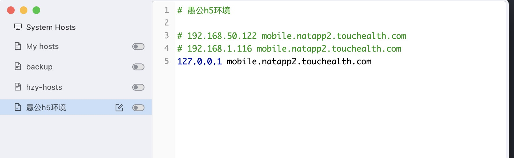
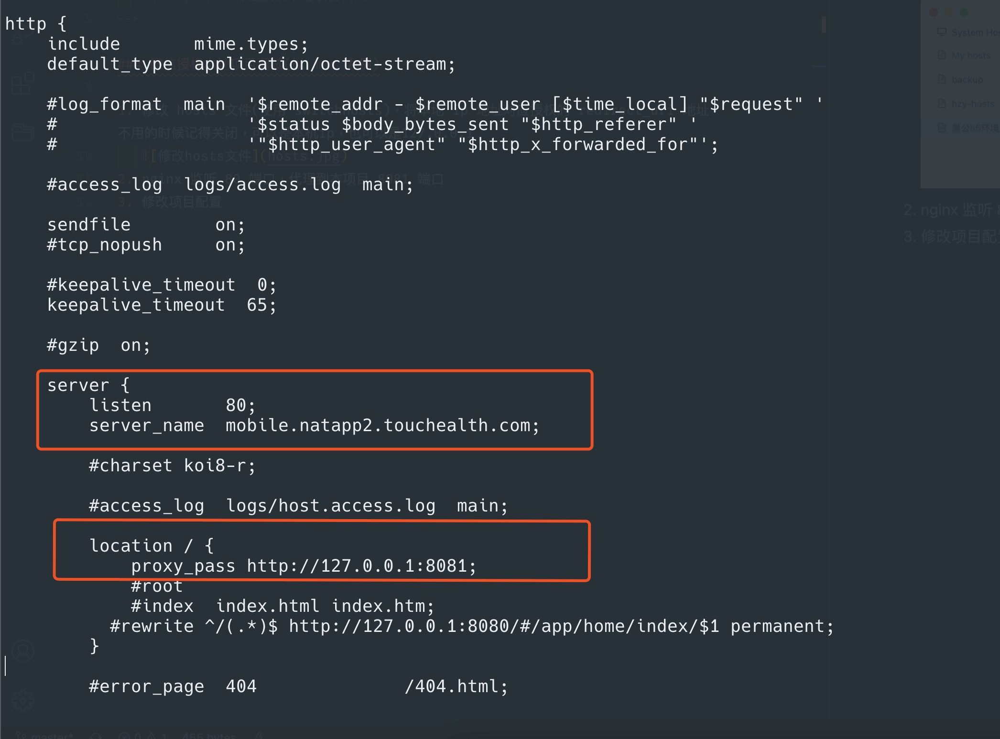
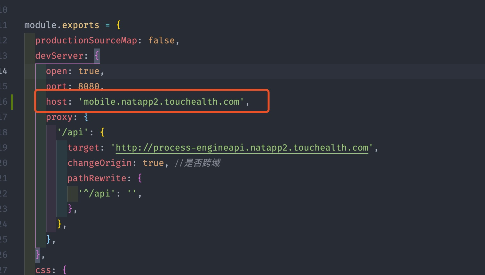

<!--
 * @Author: wy
 * @LastEditors: Please set LastEditors
 * @Description: 微信授权本地项目调试
-->

### 微信授权本地项目调试(以 mac 为例)

1. 修改 hosts 文件(使用 switchHosts)，将本地 ip 地址对应授权的 redirect_uri 地址，不用的时候记得关闭，可以是本机 ip，也可以是 127.0.0.1
   
2. nginx 监听 80 端口，代理到本项目 8081 端口，service_name需与hosts的域名一致，代理的地址也需与hosts的ip地址一致，再加上项目的端口号
   
3. 修改项目配置，需添加host为hosts的域名
   
4. 启动微信开发者工具进行调试
