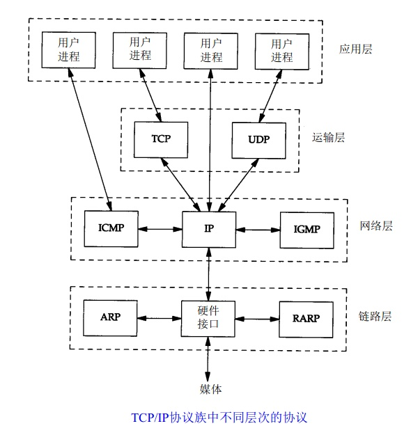
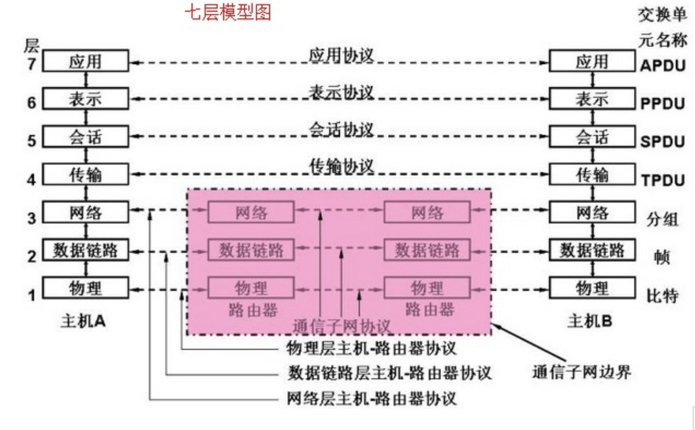
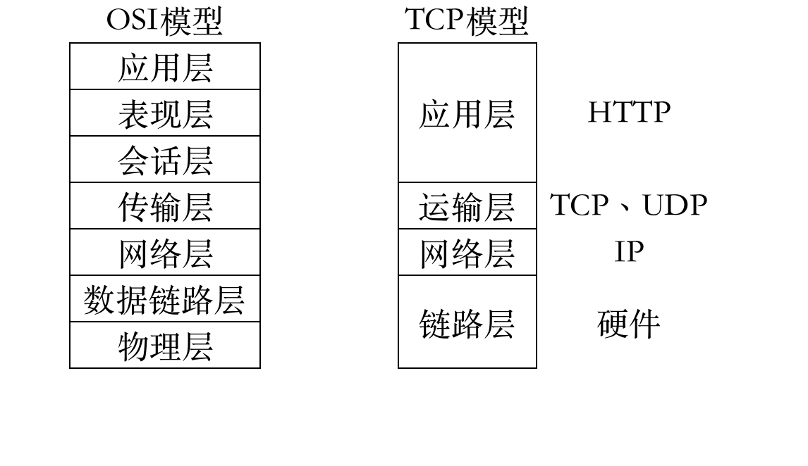
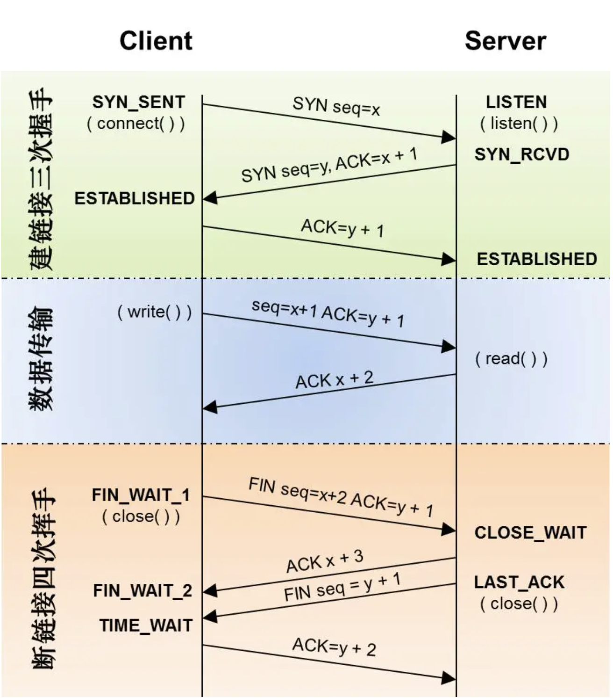
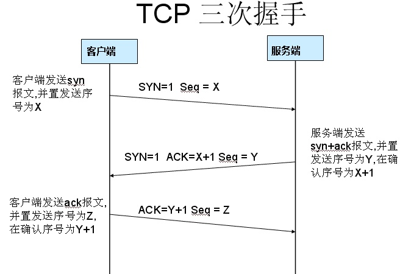

<!--
 * @Author: your name
 * @Date: 2020-06-24 09:08:19
 * @LastEditTime: 2020-06-29 20:48:47
 * @LastEditors: Please set LastEditors
 * @Description: In User Settings Edit
 * @FilePath: /learningnotes/整理/一个URL的请求过程.md
-->

### 一个 URL 请求过程的步骤

#### 浏览器缓存[缓存相关内容](./性能优化.md)

假设当这个 URL 非第一次请求，会触发浏览器缓存策略；如果是第一次请求的话，会直接从服务器拉取

#### DNS 域名解析

> DNS，全名 Domain Name System，域名系统的英文缩写。将域名与 IP 地址相映射的分布式数据库，方便用户直接输入域名就可以访问网站，无需记住网站对应的 IP 地址。

##### DNS 是多对多的，分如下两种情况

1. 多个域名对应一个 IP(如虚拟机内开辟多块空间，都指向同一个 IP)
2. 一个域名对应多个 IP(Nginx 的负载均衡)

作用：根据域名查出与之对应的 IP 地址

##### 域名层级

> 域名结构是树状结构，树的最顶端叫根域名；根的下一次叫顶级域名，如.com、.cn、.net 等和.cn、.uk 等国家域组成；像 baidu.com 都是二级域名；简而言之域名是由整体到局部的机制结构。
> .png>)

1. 根域名：所有域名的尾部都有根域名。比如 www.aaa.com，真正的域名是 www.aaa.com.root，对于所有域名都是一样，平时一般省略
2. 顶级域名：如 www.aaa.com 中的.com 就是顶级域名
3. 二级域名：如 www.aaa.com 中的 aaa 就是二级域名
4. 三级域名(主机名 host)：如 www.aaa.com 中的 www 就是三级域名；这是用户在服务器上配置的，用户可以任意分配

##### 域名解析流程

##### 递归查询

##### 迭代查询

#### 建立 TCP/IP(面向连接) 连接

> TCP/IP 协议栈是一组不同层次上的多个协议的组合，通常被认为是一个四层协议系统，与 OSI 的七层模型相对应。HTTP 协议是基于 TCP/IP 协议模型来传输信息。TCP/IP 是面向连接的。
> 

##### 什么是 OSI(七层) 模型

> OSI 模型全名 Open System InterConnect 即开放式系统互联，是国际标准化组织(ISO)提出的一个试图使各种计算机在世界范围内互连为网络的标准框架，简称 OSI。
> 计算机通讯需要用到必要的软件支持，它就是计算机网络参考模型（即计算机网络软件），最经典的就是我们所要讲解的 OSI 模型。它是通过一个机器上的一个应用进程与另一个机器上的进程进行信息交互。
> OSI 是一个逻辑上的定义，是个规范，它把网络从逻辑上分为了 7 层

##### OSI 和 TCP 模型对应

> 运输层，即传输层，主要为两台主机上的应用程序提供端到端的通信。TCP/IP 协议中，包含了两个不同的传输协议：TCP(传输控制协议) 和 UDP(用户数据报协议)

##### TCP 与 UDP 的区别

1. TCP 是可靠的，虽然会存在丢包的现象，但能追踪到数据。TCP 采用超时重传、发送和接收端到端的确认分组等机制。
2. UDP 是不可靠的，只负责将数据报传送至另一端，不保证数据能到达另一端。UDP 协议任何必需的可靠性必须由应用层来提供。

浏览器在发送 HTTP 请求之前，需要在浏览器和服务器之间建立一条 TCP/IP 连接。**一次 TCP 连接主要分为三个部分：建立连接(TCP 三次握手)、数据传输、断开连接(TCP 四次挥手)**，如图下：

##### TCP 三次握手

**目的：TCP 三次握手是为了同步连接双方的序列号和确认号并交换 TCP 窗口大小信息。**

1. **第一次握手**：由客户端发起 TCP 连接，先向服务端发出连接请求报文段(SNY 报文段，其 SYN 标志被置位)设置首部中的同步 SYN = 1，同时发送初始序号 seq = x，客户端进入 SYN_SEND 状态，等待服务器的确认
2. **第二次握手**：服务器接收到请求报文后即 SYN = 1，对报文段进行确认，设置应答号 ACK = x + 1(客户端发送的 seq+1)，同时服务端将 SYN 位置为 1，seq = y。服务器将上述信息一并发送给客户端，此时服务器进入 SYN_RECV 状态
3. **第三次握手**：客户端收到服务器发送过来的 SYN + ACK + SEQ 后，然后设置 ack = y(服务器 seq + 1) +1 发送给服务端，服务器和客户端都进入 ESTABLISHED 状态，三次握手完成

##### 为什么是三次握手

就跟人打电话是一样的场景
A：喂，在吗？
B：我在，你听的到我吗？
A：我能听到

#### HTTP 请求与响应

#### 浏览器获得资源并渲染页面

#### 浏览器请求获取其他资源

#### 关闭 TCP/IP 连接

##### TCP 四次挥手

1. **第一次挥手**：客户端发起连接释放报文段(FIM 报文段，其 FIN 标志被置位)，设置释放报文段道部终止控制位 FIN = 1，同时一并发送 seq(序号)、ack 给服务器，告诉对方准备关闭
2. **第二次挥手**：服务器收到客户端发送来的 FIN 报文段，向客户端发送 ACK(seq + 1) 应答包，告诉客户端我已收到你的信息
3. **第三次挥手**：服务器向客户端发送 FIN 报文段和 seq，告诉客户端，我这也没有数据要传输了，可以关闭连接
4. **第四次挥手**：客户端收到服务端的 FIN 报文段后，向服务端发送 ack(seq + 1)，服务端收到客户端信息后，关闭连接；客户端等待 2MSL 后，客户端关闭连接

##### 为什么二次挥手和三次挥手不能合并成一个包

1. 理论上是可以合成一个，但是从协议设计的角度上来，不能适合合成一个包
2. TCP 上包分为两类，一类为控制包，另一类为数据包；建立连接和关闭连接都为控制包，数据传输为数据包
3. 控制包是按操作原子性设计的，简单点讲就是这个控制包分的不能再分为止

##### 为什么是四次挥手

跟人打电话一样的场景
A：B，我要准备关闭连接了
B：好的，我收到了
B：我这也没有要说的话了，我也准备关闭连接了
A：好的，我不接收你的话了

**客户端先向服务端发送关闭请求，表示客户端没有数据要发送了，服务端确认，但是此时服务端还可以向客户端发送数据，待服务端没有数据传送时，此时服务端也向客户端发送关闭请求，然后客户端确认。**
