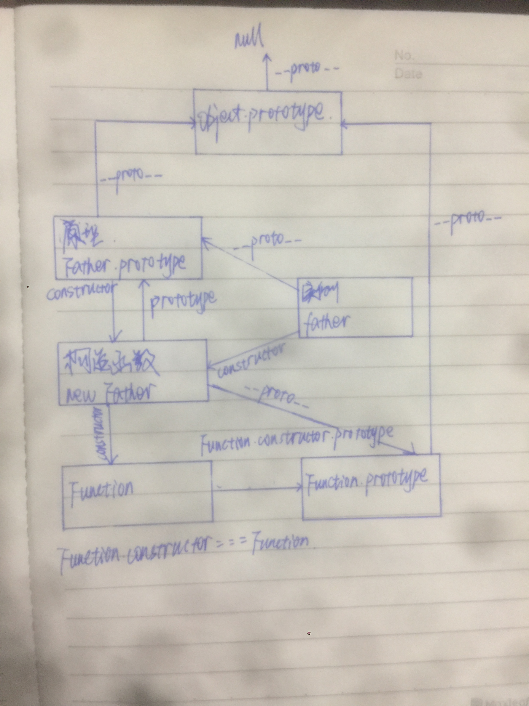

<!--
 * @Author: your name
 * @Date: 2020-05-19 09:40:38
 * @LastEditTime: 2020-05-19 17:38:55
 * @LastEditors: Please set LastEditors
 * @Description: In User Settings Edit
 * @FilePath: /learningnotes/整理/原型.md
-->

# 原型

1. prototype，即原型，一个空对象，可以给实例共享这个原型上所有的方法及属性。
2. 通过 xxx.\_\_proto\_\_指向这个原型对象进行访问

# 构造函数

通过与 new 的结合的函数，创造出一个新对象

# 实例

通过 new 和构造函数创造出来的新对象，即实例。 实例通过\_\_proto\_\_指向它的原型对象，实例的 constructor 指向它的构造函数。new 一个实例，总共有 4 个过程：

1. **创建一个新对象 let obj = {};**
2. **将新对象 obj.\_\_proto\_\_指向它的原型对象;**
3. **将 this 指针指向这个新对象**
4. **返回这个新对象即 obj,如果 return {},那就返回这个对象**

```javascript
let obj = new Object();
// obj.__proto__ 指向该原型对象
obj.__proto__ === Object.prototype; //true
// obj.构造函数指向Object
obj.constructor === Object; //true
obj.constructor.prototype === Object.prototype; //true
Object.__proto__ === Function.prototype; //true
Object.constructor === Function; //true
Object.constructor.prototype === Function.prototype; //true
Object.constructor.prototype.constructor.prototype === Function.prototype; //true
Object.prototype.__proto__ === null; //true
Function.prototype.__proto__ === Object.prototype; //true
Function.__proto__ === Function.prototype; //true
```

```javascript
function Father(name, age) {
  this.name = name;
  this.age = age;
}
Father.prototype.say = function () {
  return `Hello ${this.name},I'm ${this.age} years old`;
};
let father = new Father("Mike", 22);
console.log(father);
console.log(father.say());
```



# 原型链

原型链是由原型对象组成，每个对象都有\_\_proto\_\_属性，指向该构造函数的原型对象，\_\_proto\_\_将对象连接起来，组成了原型链。用来实现共享属性和继承的对象链。

```javascript
function Father(age) {
  this.age = age;
}
Father.prototype.name = "Mike";
let father = new Father(22);
father.name = "Cook";
console.log(father.name); //Cook
//检测name属性是否在实例对象中 true
console.log(father.hasOwnProperty("name"));
delete father.name;
console.log(father.name); //Mike
console.log(father.hasOwnProperty("name")); //false
```

1. 属性查找：如果自身没有这个属性，则会顺着它的原型链往上找，如果原型链上有，则打印；如果查询到顶层原型链都没有，那就打印 **undefined**
2. 修改属性：可以直接修改 prototype 上属性的值，但是这样会对每个实例都产生影响

# ES5 写法

```javascript
function Father(name, age) {
  this.name = name;
  this.age = age;
}
Father.prototype.say = function () {
  return `Hello ${this.name}, I'm ${this.age} year old`;
};
let father = new Father("Mike", 22);
//遍历原型链
for (let i in father) {
  console.log(i); //name,age,say
}
//如果将原型重写，这时它的constructor会丢失，指向Object
Father.prototype = {
  say: () => {
    return `Hello ${this.name}, I'm ${this.age} year old`;
  },
};
Father.prototype.constructor === Object; // true
//如果修正constructor
Father.prototype = {
  constructor: Father,
  say: () => {
    return `Hello ${this.name}, I'm ${this.age} year old`;
  },
};
let father = new Father("Mike", 22);
// constructor变成可枚举属性
for (let i in father) {
  console.log(i); // name,age,say,constructor
}
//将constructor设置成不可枚举
Object.defineProperty(Father.prototype, "constructor", {
  enumerable: false,
  value: Father,
});
for (let i in father) {
  console.log(i); //name,age,say
}
```

# 继承

- **原型链继承，引用类型被所有实例共享，修改引用类型的值，所有实例都会被修改**

```javascript
function Father() {
  this.name = ["Mary"];
}
function Son() {}
//既是Father的实例，也是Son的原型，继承了Father的实例属性和方法及Father.prototpye上的所有方法和属性
Son.prototype = new Father();
let son = new Son();
son.name.push("Mike");
let anotherSon = new Son();
console.log(anotherSon.name); // Mary,Mike
```

上面原型继承有一个缺点，引用类型被所有实例共享，改变引用类型的值，导致所有实例的相同属性都会被更改

- **借用构造函数(经典继承或伪造对象),避免修改引用类型时，所有实例都被共享;但是原型对象上的方法没办法共享**

```javascript
function Father() {
  this.name = ["Mary"];
  this.say = function () {
    console.log(this.name);
  };
}
Father.prototype.say = function () {
  console.log(this.name);
};
function Son() {
  Father.call(this);
}
let son = new Son();
son.name.push("Mike");
console.log(son.name); // [Mary,Mike]
let anotherSon = new Son();
console.log(anotherSon.name); // [Mary]
```

```javascript
function Father(name, age) {
  this.name = name;
  this.age = age;
}
function Son(job, ...args) {
  Father.call(this, ...args);
  //或
  Father.apply(this, args);
  this.job = job;
}
let son = new Son("web", "Mike", 22);
console.log(son); // {job:'web',name:'Mike',age:22}
```

- **组合继承(解决修改引用类型实例被共享，同时可以共享原型对象上的方法),采用原型继承和借用构造函数的方法**
- **组合继承，父类构造函数会被调用两次，一次使用子类构造函数，父类被调用一次，另一次是实现子类原型时，调用父类构造函数，并创建实例，子类原型同时拥有父类构造函数的属性及父类 prototype 上的所有方法和属性**

```javascript
function Father(name, age) {
  this.name = name;
  this.age = age;
  this.names = [];
}
Father.prototype.say = function () {
  console.log(this.name, this.age);
};
function Son(job, ...args) {
  //Father这里被调用一次
  Father.call(this, ...args);
  this.job = job;
}
//Father这里被调用一次
Son.prototype = new Father();
//修正构造函数，指向自己
Son.prototype.constructor = Son;
let son = new Son("web", "Mike", 22);
son.names.push(1);
let another = new Son("java", "Cook", 23);
console.log(son); // {name:'Mike',age:22,job:'web',names:[1]}
console.log(another); // {name:'Cook',age:23,job:'java',names:[]}
```

- 寄生组合继承(使用中介)
- 解决构造函数被调用两次，同时解决原型对象上的方法可以被共享，同时解决引用类型修改不影响所有实例

```javascript
function Father(name) {
  this.name = name;
  this.ages = [];
}
Father.prototype.say = function () {
  console.log(this.name, this.ages);
};
function Son(job, ...args) {
  Father.call(this, ...args);
  this.job = job;
}
Son.prototype = Object.create(Father.prototype);
Son.prototype.constructor = Son;
let son = new Son("web", "Mike");
son.ages.push(22, 23);
let another = new Son("java", "Cook");
```

# ES6

ES6 是 ES5 的语法糖

```javascript
class Father {
  //等于es5自身属性
  constructor(name, age) {
    this.name = name;
    this.age = age;
  }
  //等于es5 Father.prototype上的方法
  say() {
    return `Hello ${this.name}, I'm ${this.age} year old`;
  }
  //在原型上定义属性
  get names() {
    let names = "cook";
    return names;
  }
}
let father = new Father("Mike", 22);

function Father(name, age) {
  this.name = name;
  this.age = age;
}
Father.prototype.say = function () {
  return `Hello ${this.name}, I'm ${this.age} year old`;
};
let father = new Father("Mike", 22);
```

# ES6 与 ES5 继承的区别

1. ES5 不使用 new，不会报错，即普通函数,this 指向 window 或 undefined；ES6 不使用 new 报错：Uncaught TypeError: Class constructor Father cannot be invoked without 'new'
2. 使用 ES5 原型对象上的方法可以被遍历；而 ES6 原型对象上的**方法不能被遍历出来**

```javascript
//接上面ES5代码(遍历所有可枚举属性)
for (let i in father) {
  console.log(i); // name,age,say
}
Object.keys(Father.prototype); // ['say']
//接上面ES6写法(遍历所有可枚举属性)
for (let i in father) {
  console.log(i); // name,age
}
Object.keys(Father.prototype); //[]
```
