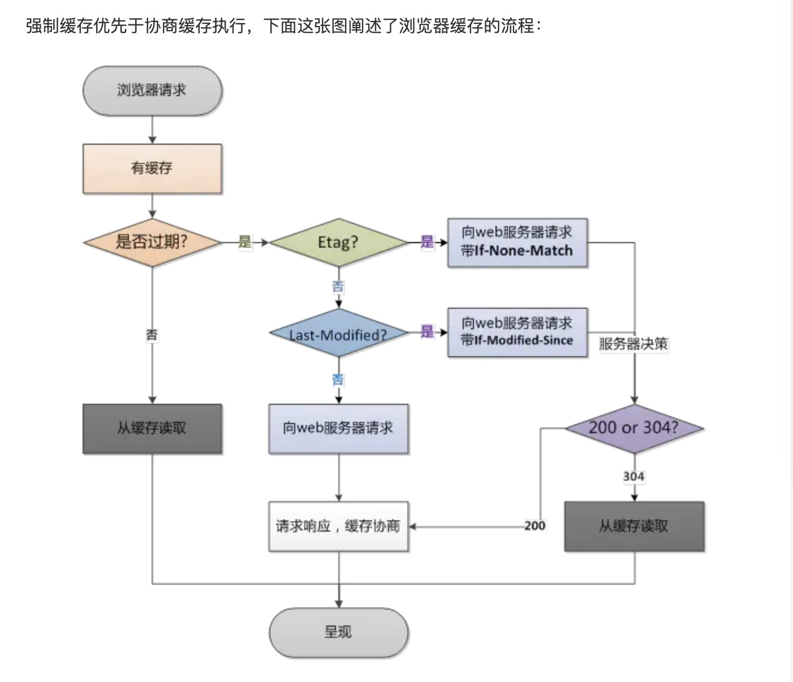
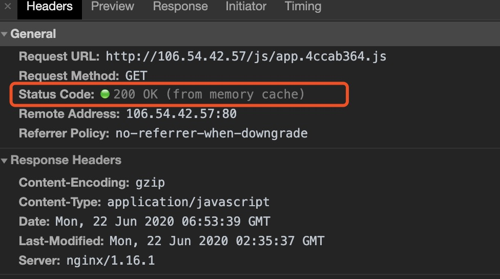
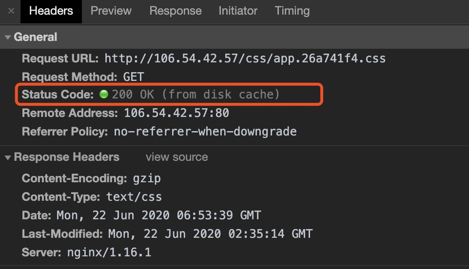

<!--
 * @Author: your name
 * @Date: 2020-06-19 09:49:30
<<<<<<< HEAD
 * @LastEditTime: 2020-08-11 20:01:40
=======
 * @LastEditTime: 2020-08-11 20:16:46
>>>>>>> cdb7b72... 22222
 * @LastEditors: Please set LastEditors
 * @Description: In User Settings Edit
 * @FilePath: /learningnotes/整理/性能优化.md
-->

### 性能优化

#### 加速首屏渲染时间(新增加)
<<<<<<< HEAD

=======
1111 2222
>>>>>>> cdb7b72... 22222
1. 路由文件懒加载
2. 所有 js 文件不做预加载
3. 对于大文件采用压缩成 gzip 的形式(compression-webpack-plugin)
4. 开启浏览器缓存
5. 配置 nginx(http 中):
   - 开启 gzip on;
   - 设置 gzip_types text/plain text/css application/json application/x-javascript text/xml application/javascript text/javascript;
   - gzip_comp_level 5;(压缩等级，一般取中间值,等级太高会影响速

#### webpack 插件压缩 gzip 和 nginx 开启 gzip 有什么区别

1. webpack 在构建打包文件时，会将文件压缩成 gzip 后，可以直接保存在服务器上
2. nginx 会在请求时，对文件进行压缩
3. 使用 webpack 进行对大文件压缩成 gzip 的好处在于减少服务器的压力，以及节约请求返回时间；因为 nginx 请求服务器时需要对文件进行压缩后才返回

#### 缓存策略

> 缓存的意义：节省带宽、提升访问速度，降低服务器压力

浏览器缓存一般分为**强制缓存**和**协商缓存**两种

#### 强制缓存

**什么是强制缓存?**

- **强缓不会向服务器发送请求，直接从本地缓存中读取文件**，返回状态码为 200。强制缓存使用 expires/Cache-Control，或不对 nginx 设置，如下图两个就是不对 nginx 进行设置的反馈

> from memory cache 不访问服务器，直接从本地内存中读取文件；浏览器关闭后，数据就会不存在，下次再打开浏览器时，不会出现 from memory cache

> from disk cache 不访问服务器，直接从本地磁盘中读取文件；浏览器关闭后，数据不会被丢失，下次打开浏览器时，还是会从磁盘读取文件

### 优先访问 from memory cache，其次访问 from disk cache

#### expires/Cache-Control

**expires**：是 http1.0 提出的，设置文件过期时间。如果在设置的时间内，直接从缓存中读取文件；如果时间过期，从服务器重新下载文件。设置 expires 见'https://nginx.org/en/docs/http/ngx_http_headers_module.html#add_header'

**Cache-Control**：是 http1.1 新增的，有以下 6 种设置，主要使用 no-cache 和 max-age

- no-cache：不使用本地缓存。需要使用缓存协商，先与服务器确认返回的响应是否被更改，如果之前的响应中存在 ETag，那么请求的时候会与服务端验证，如果资源未被更改，则可以避免重新下载。
- no-store：禁止一切缓存，每次都从服务器上下载文件
- max-age：设置过期时间，单位为秒；如 nginx 中 http 中写入 add_header Cache-Control max-age=60;文件 60s 后过期
- public：可以被所有的用户缓存，包括终端用户和 CDN 等中间代理服务器
- private：只能被终端用户的浏览器缓存，不允许 CDN 等中继缓存服务器对其缓存
- s-maxage：和 max-age 是一样的，不过它只针对代理服务器缓存而言

#### Cache-Control 优先级高于 expires，一般的话同时设置

#### 协商缓存

**什么是协商缓存?**

- **协缓会向服务器发送请求**，服务器根据 http 请求头的一些参数来判断是否命中协商缓存；如果命中，返回 http 状态码为 304。协商缓存主要使用的是 **Last-Modified/If-Modified-Since** 和 **Etag/If-None-Match**

#### Etag/If-None-Match(这两是一对)

> Eatg 和 If-None-Match,客户端第一次请求时，响应头会带 ETag: "5ef07b26-119a49"，客户端再次请求时，请求头会有一个 If-None-Match: W/"5ef07b26-119a49"，服务器会校验这个值是否与 Etag 的值相等。如果两个值相等，直接从缓存里读取文件，返回 http 状态码 304，如果不相等，返回状态码 200

#### Last-Modified/If-Modified-Since(这两是一对)

> Last-Modified 和 If-Modified-Since，第一次请求资源的时候，响应头会返回一个 Last-Modified: Mon, 22 Jun 2020 09:34:30 GMT，再次请求时，请求头会带着 If-Modified-Since: Mon, 22 Jun 2020 09:34:30 GMT，服务器会校验这两个值是否有变动，如果 Last-Modified 的值比它大，说明资源已被更新，返回状态码 200 并获取最新文件；如果值相等，直接返回状态码 304，从缓存中拉取文件

- Etag 是 Hash 算法，属于 HTTP1.1 的属性
- Last-Modified 是文件最后修改时间，精确到秒;精准度上是 Etag 更精准
- Etag 优先级高于 Last-Modified，服务器会先校验 Etag
- Last-Modifed/If-Modified-Since 是 http1.0 的头字段
